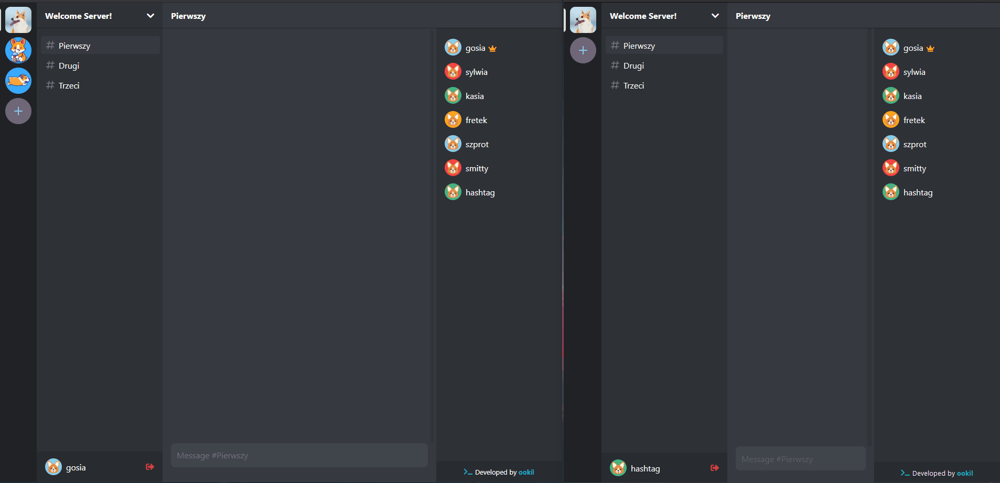

# Discorgi

[Live Demo](https://discorgi.herokuapp.com/)

This project was made entirely by me in order to experiment with GraphQL and Apollo. This is not ment to be an exact replica of Discord but I tried to implement as many core features as I was able to.discr

If you would like to find any errors or missing features don't hesitate to point them out or contribute.

Yes, it's not responsive and was designed mostly for desktops.

## Build with

- [React](https://reactjs.org/)
- [Apollo](https://www.apollographql.com/)
- [GraphQL](https://www.apollographql.com/)
- [Prisma](https://www.prisma.io/)

## Run instructions

This project is separated into client and server. You have to install dependecies for both directories with

`npm install`

You also have to create a sqlite database inside `server/prisma/`.

If you also want to have access to Apollo Studio follow [this instructions](https://www.apollographql.com/docs/studio/getting-started/)
